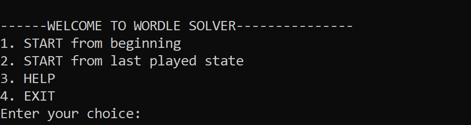

# WELCOME TO WORDLE SOLVER

## How to USE:

Simply Download the pre-compiled .exe application and run it.

Alternatively you can also download the cpp file and compile it to run the code.

Once you run the code you'll be greeted with the Main Homescreen

Enter 1 to start guessing for a fresh new game.

else Enter 2 to start guessing from middle of a game.

You can enter 3 for help and 4 to exit out of the application.

For eg. you enter 1 you will get:

 

Once you enter the word into wordle

you get bbyby i.e (blakck,black,yellow,black,yellow)

So enter the corresponding gyb sequence for the word in the application to get the next guess word.

If you want to get another suggestion only enter x as input

you will get a new word to guess if you enter x. So you can enter x to get new suggestion or else when a guessed word doesn't exist in the dictionary.

Alternatively you can also open LiveCodeBrain.txt a text file which shows you a list of words possible (It mimics how the code is thinking).

Keep playing and the code shall guess the word correctly : ) { Hopefully most of the times!!!}

Feel free to use the cpp code, and to share suggestions.

Happy Wordling!!!!!!!!!!!!
